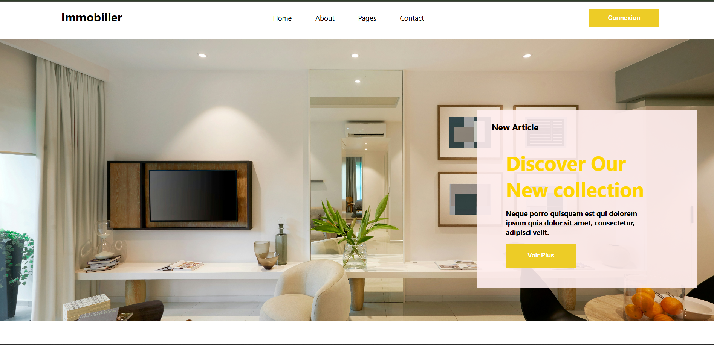

# IMMO-KEYS

site web immobilier conçu pour présenter des biens en ligne. J’ai réalisé la maquette sur Figma et développé le site avec HTML, CSS et JavaScript, en mettant l’accent sur l’ergonomie, la navigation et la présentation des annonces.

 
 

